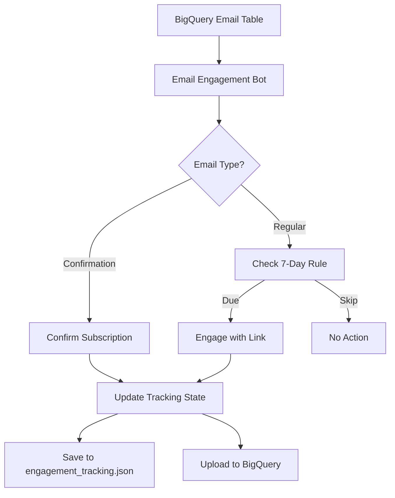

# Email Engagement Bot 🤖

Automated email engagement system that confirms subscriptions and maintains brand engagement through strategic link clicking.

## Overview

This bot automatically:
- ✅ **Confirms subscription emails** (welcome emails, email verification)
- 🎯 **Engages with brands** (clicks 1 link per brand every 7 days)
- 📊 **Tracks engagement history** (prevents over-engagement)
- 🔄 **Runs automatically** via GitHub Actions (daily at 10 AM & 6 PM UTC)

## Architecture

### Core Components

1. **`email_engagement_bot.py`** - Main bot logic
2. **`email_engagement_automation.yml`** - GitHub Actions workflow
3. **`engagement_tracking.json`** - Local state persistence
4. **BigQuery Integration** - Queries emails & stores tracking data

### Data Flow



## Features

### 🔍 Smart Email Detection
- **Confirmation Emails**: Detects subscription confirmations, email verifications, account activations
- **Engagement Emails**: Filters out unsubscribe/administrative emails
- **Link Extraction**: Prioritizes brand-specific links over generic ones

### ⏰ 7-Day Engagement Cycle
- Tracks `last_engaged` timestamp per brand
- Only engages once every 7 days per brand
- Prevents spam-like behavior

### 🎛️ Configurable Limits
- Max confirmations per run (default: 20)
- Max engagements per run (default: 30)
- Dry run mode for testing
- Confirmations-only or engagements-only modes

### 📊 Tracking & Analytics
- Engagement count per brand
- Last engagement date and URL
- Confirmation history
- BigQuery integration for analytics

## Usage

### Local Testing

```bash
# Install dependencies
pip install -r requirements.txt
playwright install chromium

# Test in dry run mode
python test_email_engagement.py

# Run with custom limits
python email_engagement_bot.py --max-confirmations 10 --max-engagements 15 --dry-run
```

### Manual GitHub Workflow

1. Go to **Actions** → **Email Engagement Automation**
2. Click **Run workflow**
3. Configure options:
   - `engagement_only`: Skip confirmations
   - `confirmations_only`: Skip engagement
   - `max_confirmations`: Limit confirmations (default: 20)
   - `max_engagements`: Limit engagements (default: 30)
   - `dry_run`: Test mode without clicking links

### Command Line Options

```bash
python email_engagement_bot.py [OPTIONS]

Options:
  --engagement-only     Only process engagement emails, skip confirmations
  --confirmations-only  Only process confirmation emails, skip engagement  
  --dry-run            Query emails but don't click links
  --max-confirmations  Maximum confirmations to process (default: 20)
  --max-engagements    Maximum brands to engage with (default: 30)
  --headless           Run browser in headless mode (default: True)
```

## Configuration

### Environment Variables (GitHub Actions)

| Variable | Description | Required |
|----------|-------------|----------|
| `BIGQUERY_CREDENTIALS` | Service account JSON | ✅ |

### BigQuery Tables

- **Source**: `instant-ground-394115.email_analytics.marketing_emails_clean_20250612_082945`
- **Tracking**: `instant-ground-394115.email_analytics.engagement_tracking`

### Engagement State Schema

```json
{
  "confirmations": {
    "brand.com": {
      "last_confirmed": "2025-06-14T10:30:00Z",
      "confirmation_urls": ["email_id_1", "email_id_2"]
    }
  },
  "engagements": {
    "brand.com": {
      "last_engaged": "2025-06-14T10:30:00Z", 
      "last_url": "https://brand.com/products",
      "engagement_count": 5
    }
  },
  "last_run": "2025-06-14T10:30:00Z"
}
```

## Scheduling

### Automatic Runs
- **10 AM UTC**: Morning engagement cycle
- **6 PM UTC**: Evening engagement cycle

### Manual Triggers
- Via GitHub Actions UI
- Via API/workflow dispatch

## Safety Features

### Anti-Spam Protection
- 7-day minimum between brand engagements
- Configurable daily limits
- Excludes unsubscribe/admin links
- Browser fingerprinting resistance

### Link Filtering
- Skips unsubscribe, preferences, privacy policy links
- Prioritizes brand-specific URLs
- Removes social media links
- Validates HTTP/HTTPS only

### Error Handling
- Graceful browser failures
- BigQuery connection retries
- State persistence on errors
- Comprehensive logging

## Monitoring

### Logs & Artifacts
- Screenshot verification of clicked links
- Detailed engagement reports
- Error logs with timestamps
- Artifact retention (30 days)

### BigQuery Analytics
```sql
-- Engagement overview
SELECT 
  brand_domain,
  engagement_type,
  activity_count,
  last_activity
FROM `instant-ground-394115.email_analytics.engagement_tracking`
ORDER BY last_activity DESC;

-- 7-day engagement summary
SELECT 
  COUNT(*) as total_brands,
  SUM(CASE WHEN engagement_type = 'engagement' THEN activity_count ELSE 0 END) as total_engagements,
  SUM(CASE WHEN engagement_type = 'confirmation' THEN activity_count ELSE 0 END) as total_confirmations
FROM `instant-ground-394115.email_analytics.engagement_tracking`;
```

## Troubleshooting

### Common Issues

**🔍 "No BigQuery credentials found"**
- Ensure `bigquery_credentials.json` exists locally
- Check `BIGQUERY_CREDENTIALS` secret in GitHub

**🤖 "Browser launch failed"** 
- Install Playwright browsers: `playwright install chromium`
- Check system dependencies: `playwright install-deps`

**📧 "No emails found"**
- Verify BigQuery table name and permissions
- Check date filters (emails from last 30 days)

**🔗 "No links extracted"**
- Check email HTML content quality
- Verify link filtering rules

### Debug Mode

```bash
# Run with verbose logging
python email_engagement_bot.py --dry-run --max-confirmations 1

# Check engagement state
python -c "
import json
with open('engagement_tracking.json') as f:
    print(json.dumps(json.load(f), indent=2))
"
```

## Contributing

1. Test changes locally with `--dry-run`
2. Update limits for testing (`--max-confirmations 1`)
3. Verify BigQuery queries and link extraction
4. Check GitHub Actions workflow syntax

## Security Considerations

- BigQuery credentials stored as encrypted secrets
- Browser runs in sandboxed environment
- No persistent user data storage
- Rate-limited to prevent abuse
- Headless operation (no UI exposure) 